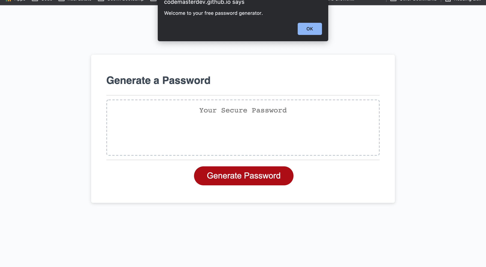

# Password Generator 

## Description
A password generator that takes user input using Javascript to generate a random secure password

### This project can be found:

- [GitHub Repository](https://github.com/codemasterdev/pw-gen)
- [Live Deployment](https://codemasterdev.github.io/pw-gen/)

## Technologies

> The following were used in this project:

- `HTML`
- `CSS`
- `Git`
- `GitHub`
- `JavaScript`
- Coded with `VS Code`

## Images

